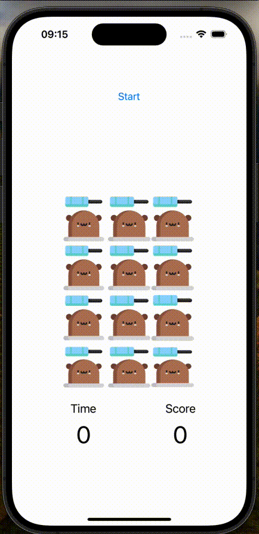

# Moles Whacker

Le projet « Moles Whacker » consiste en un jeu de la taupe bien connu dans les salles d’arcade. Le but est de taper, à l’aide d’un marteau, sur un maximum de taupes, sortant de leur trou de manière aléatoire, et dans un temps donné.

## Screenshots

